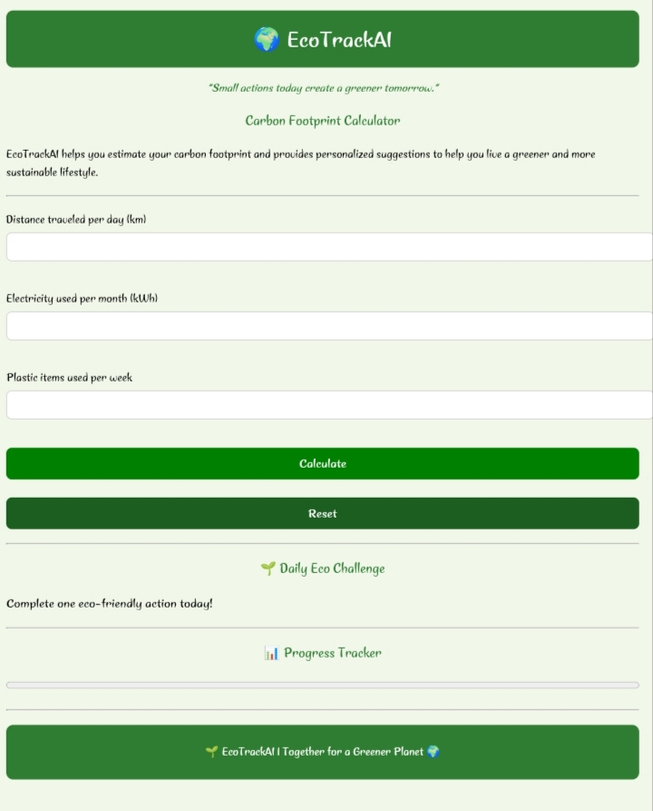
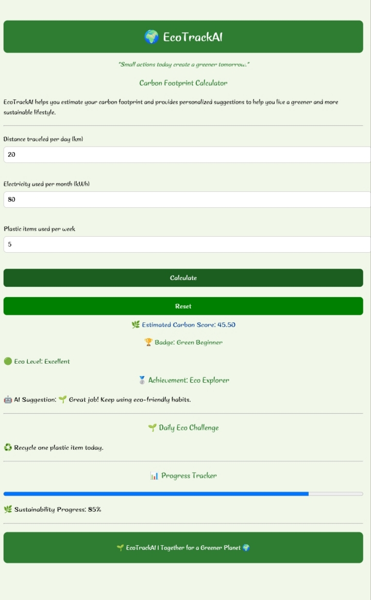

🌍 EcoTrackAI

Carbon Footprint Awareness Platform

EcoTrackAI is a web application designed to help users understand and reduce their environmental impact. The platform estimates a carbon footprint score based on travel distance, electricity consumption, and plastic usage, then provides sustainability insights and eco-friendly recommendations.

---

🎯 Project Objective

The objective of EcoTrackAI is to create awareness about carbon emissions generated through daily activities and encourage users to adopt environmentally responsible habits.

---

✨ Features

- 🌱 Carbon Footprint Calculator
- 💡 Personalized sustainability suggestions
- 🏆 Achievement Badge System
- 🎯 Eco Level Classification
- 📊 Sustainability Progress Tracker
- 🌿 Daily Eco Challenges
- 🔄 Reset Functionality
- ✅ Input Validation
- 📱 Mobile-Friendly Design

---

🛠️ Technologies Used

- HTML5
- CSS3
- JavaScript
- GitHub
- GitHub Pages

---

⚙️ How It Works

Inputs

The user provides:

1. Distance traveled per day (km)
2. Electricity consumption per month (kWh)
3. Plastic items used per week

Carbon Score Calculation

The carbon score is calculated using:

Carbon Score = (Travel × 0.2) + (Electricity × 0.5) + (Plastic × 0.3)

Output

Based on the calculated score, the application displays:

- Sustainability suggestions
- Achievement badges
- Eco levels
- Progress tracking information
- Daily eco-friendly challenges

---

🧪 Testing Performed

The application was tested for:

- Empty input validation
- Negative value validation
- Low carbon score scenarios
- Medium carbon score scenarios
- High carbon score scenarios
- Reset functionality
- Progress tracker updates
- Mobile browser compatibility

---

🔒 Security Considerations

- Input validation for empty fields
- Prevention of negative values
- Controlled user input processing
- No storage of personal user data

---

♿ Accessibility

- Clear labels for all form elements
- Readable font sizes
- Mobile-responsive interface
- Simple navigation and layout

---

🚀 Future Enhancements

- User authentication
- Carbon footprint history tracking
- Advanced analytics dashboard
- Real AI-powered sustainability recommendations
- Cloud database integration
- Community leaderboard

---
## 📸 Screenshots

### Home Page

### Result Page

👩‍💻 Author

Developed as part of Challenge 3: Carbon Footprint Awareness Platform.
